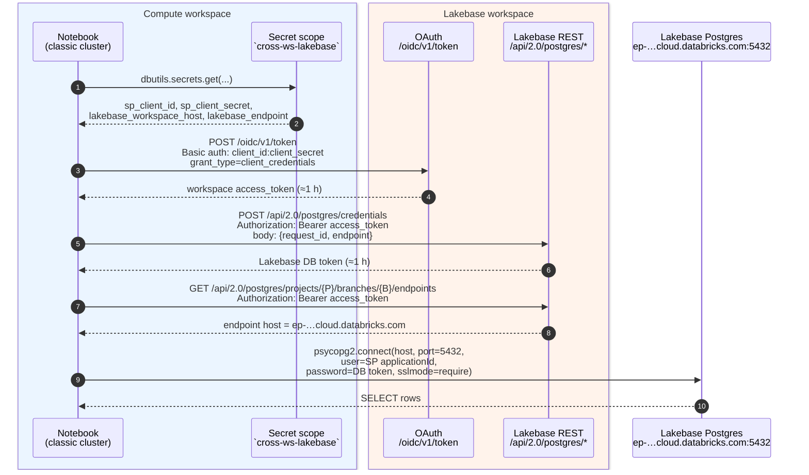
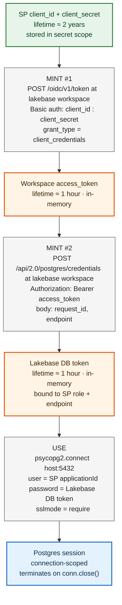

# Cross-Workspace Lakebase Access from Classic Compute

How to read a **Lakebase** instance that lives in one Databricks workspace from a
**classic-compute notebook** running in a *different* workspace, both on AWS.

Verified end-to-end on 2026-05-27:

- **Lakebase workspace** holds the Lakebase autoscaling project; the production
  branch must be in state `READY`.
- **Compute workspace** runs the notebook on a classic cluster — tested on both
  a job cluster and an interactive all-purpose cluster (DBR 15.4 LTS,
  single-user, `i3.xlarge`, 1 worker).
- Both workspaces in the same Databricks account, same AWS region.
- The notebook authenticates as a service principal via OAuth m2m, mints a
  Lakebase database credential, then connects with `psycopg2` and runs real
  `SELECT`s.

---

## How the pieces fit together



The hop from the notebook to Postgres is direct over the public internet — no
PrivateLink, no VPC peering, no special networking is needed for this specific
flow (the Lakebase endpoint is reachable from any classic Databricks cluster
with default egress).

### Credential mint chain

The notebook holds **three** credentials over the course of one run, each
shorter-lived than the one before. The point of this diagram is to make the
two-mint chain obvious: the workspace access token is *not* what Postgres
accepts — it's only the thing that authorises minting the *Lakebase* DB token.



Reading the chain top-to-bottom:

- **Green** = long-lived credential (lives in the secret scope).
- **Gray** = a single HTTP call that transforms one credential into the next.
- **Orange** = ephemeral credential held in notebook memory.
- **Blue** = the live Postgres connection.

**Why two mints?** The `/oidc/v1/token` flow proves *who you are* to the
Databricks workspace control plane — it's the generic m2m OAuth grant any
workspace API accepts. Lakebase Postgres doesn't trust that token directly; it
issues its *own* short-lived credential bound to the SP's Postgres role on a
specific branch/endpoint, which is what shows up at the wire as the Postgres
password. If you skip mint #2 and try to use the workspace access_token as the
Postgres password, you get `password authentication failed`.

**Practical implication.** For runs longer than ~1 hour, you can re-mint just
the Lakebase DB token from a cached workspace access token until that one also
expires; for very long-lived notebooks, wrap both mints in a refresh helper
keyed off the response `expires_in`.

---

## Prerequisites

- Databricks CLI **v0.285.0+** (`databricks --version`).
- CLI auth profiles for both workspaces:

  ```bash
  databricks auth login --host https://<lakebase-workspace> --profile lakebase-ws
  databricks auth login --host https://<compute-workspace>  --profile compute-ws
  ```

- A Lakebase autoscaling project in `lakebase-ws` whose `production` branch is
  in state `READY`:

  ```bash
  databricks postgres list-branches projects/<project-id> -p lakebase-ws -o json \
    | jq '.[] | {name, state: .status.current_state}'
  ```

  > ⚠️ If the branch is `ARCHIVED`, this won't work without first restoring it.
  > Pick another project or unarchive.

---

## Step 1 — Create a service principal in the Lakebase workspace

```bash
# Substitute your own display name
SP_NAME="cross-ws-lakebase-test"

databricks service-principals create \
  --json "{\"displayName\":\"$SP_NAME\",\"active\":true}" \
  -p lakebase-ws -o json
```

Capture two fields from the response:

- `applicationId` → this is the SP's **client_id** *and* its Postgres role name.
- `id`            → the SCIM internal id; needed for the secret API.

```bash
SP_APP_ID=<applicationId>     # UUID, e.g. xxxxxxxx-xxxx-xxxx-xxxx-xxxxxxxxxxxx
SP_SCIM_ID=<id>               # 14-digit numeric, e.g. 12345678901234
```

---

## Step 2 — Generate a workspace OAuth secret for the SP

```bash
databricks service-principal-secrets-proxy create $SP_SCIM_ID -p lakebase-ws -o json
```

Capture the `secret` value — this is the **client_secret**. It cannot be
re-displayed later, so store it now.

> The endpoint is **`service-principal-secrets-proxy`**, not
> `service-principal-secrets`. The latter is for account-level SPs.
> The proxy command operates at the workspace level — required for workspace
> OAuth flows. The CLI argument is the SCIM `id`, **not** the `applicationId`.

---

## Step 3 — Provision the SP's Postgres role on the Lakebase branch

This is the most easily-missed step. The OAuth credential mint API will hand
out tokens for the SP even without this, but Postgres-level authentication will
fail with `password authentication failed for user '<uuid>'` until the role
exists on the branch.

```bash
databricks postgres create-role \
  projects/<project-id>/branches/production \
  --role-id "sp-cross-ws-test" \
  --json "{\"spec\":{
    \"identity_type\":\"SERVICE_PRINCIPAL\",
    \"postgres_role\":\"$SP_APP_ID\",
    \"auth_method\":\"LAKEBASE_OAUTH_V1\"
  }}" \
  -p lakebase-ws -o json
```

Then, as a project member who owns the schema/tables you want the SP to read,
connect to the database and `GRANT` `CONNECT`/`USAGE`/`SELECT` to the SP's role
(named by its `applicationId` UUID, double-quoted):

```sql
-- Connect to the target database as the project owner. Replace
-- <your-database> with your DB name and $SP_APP_ID with the SP's applicationId
-- (note the double quotes around the UUID — Postgres role names that look like
-- UUIDs must be quoted).
GRANT CONNECT ON DATABASE <your-database>   TO "$SP_APP_ID";
GRANT USAGE   ON SCHEMA   public            TO "$SP_APP_ID";
GRANT SELECT  ON ALL TABLES IN SCHEMA public TO "$SP_APP_ID";
-- For future tables created later:
ALTER DEFAULT PRIVILEGES IN SCHEMA public
  GRANT SELECT ON TABLES TO "$SP_APP_ID";
```

---

## Step 4 — Stash SP creds in a secret scope in the compute workspace

```bash
SCOPE="cross-ws-lakebase"
databricks secrets create-scope $SCOPE -p compute-ws

databricks secrets put-secret $SCOPE sp_client_id            --string-value "$SP_APP_ID"          -p compute-ws
databricks secrets put-secret $SCOPE sp_client_secret        --string-value "$SP_CLIENT_SECRET"   -p compute-ws
databricks secrets put-secret $SCOPE lakebase_workspace_host --string-value "https://<lakebase-workspace-host>" -p compute-ws
databricks secrets put-secret $SCOPE lakebase_endpoint       --string-value "projects/<project-id>/branches/production/endpoints/primary" -p compute-ws
```

---

## Step 5 — Notebook that runs on classic compute

Drop this in the compute workspace and attach to any classic cluster (job or
interactive, single-user, DBR 13+).

```python
# COMMAND ----------
# MAGIC %pip install --quiet psycopg2-binary requests
# MAGIC dbutils.library.restartPython()

# COMMAND ----------
import uuid, json, requests, psycopg2

SCOPE = "cross-ws-lakebase"
CLIENT_ID     = dbutils.secrets.get(SCOPE, "sp_client_id")
CLIENT_SECRET = dbutils.secrets.get(SCOPE, "sp_client_secret")
LB_HOST       = dbutils.secrets.get(SCOPE, "lakebase_workspace_host").rstrip("/")
ENDPOINT      = dbutils.secrets.get(SCOPE, "lakebase_endpoint")

# 1. m2m OAuth against the Lakebase workspace
ws_token = requests.post(
    f"{LB_HOST}/oidc/v1/token",
    auth=(CLIENT_ID, CLIENT_SECRET),
    data={"grant_type": "client_credentials", "scope": "all-apis"},
    timeout=30,
).json()["access_token"]

# 2. Mint a Lakebase database credential
db_token = requests.post(
    f"{LB_HOST}/api/2.0/postgres/credentials",
    headers={"Authorization": f"Bearer {ws_token}"},
    json={"request_id": str(uuid.uuid4()), "endpoint": ENDPOINT},
    timeout=30,
).json()["token"]

# 3. Resolve the endpoint host
project, _, rest = ENDPOINT.removeprefix("projects/").partition("/branches/")
branch,  _, _    = rest.partition("/endpoints/")
endpoints = requests.get(
    f"{LB_HOST}/api/2.0/postgres/projects/{project}/branches/{branch}/endpoints",
    headers={"Authorization": f"Bearer {ws_token}"},
    timeout=30,
).json()["endpoints"]
host = next(e["status"]["hosts"]["host"] for e in endpoints if e["name"] == ENDPOINT)

# 4. Connect — user= is the SP's applicationId, password= is the DB token
conn = psycopg2.connect(
    host=host, port=5432, dbname="<your-database>",
    user=CLIENT_ID, password=db_token,
    sslmode="require", connect_timeout=20,
)
conn.autocommit = True
with conn.cursor() as cur:
    cur.execute("SELECT current_user, current_database(), version();")
    print(cur.fetchone())
    cur.execute("SELECT * FROM <your-table> LIMIT 5;")
    for row in cur.fetchall():
        print(row)
conn.close()
```

---

## Gotchas (every one of these bit us)

| # | Symptom | Root cause | Fix |
|---|---------|------------|-----|
| 1 | `Error: Invalid service principal id` from `service-principal-secrets-proxy create` | Used `applicationId` (UUID) | Pass the SCIM `id` (numeric) instead |
| 2 | `Field request_id must be defined` on `POST /api/2.0/postgres/credentials` | Body schema requires a client-generated `request_id` | Add `"request_id": str(uuid.uuid4())` |
| 3 | `404 Not Found` on `GET /api/2.0/postgres/endpoints?parent=...` | Wrong URL shape | Use `GET /api/2.0/postgres/projects/<P>/branches/<B>/endpoints` (path-embedded, no query param) |
| 4 | `password authentication failed for user '<uuid>'` from psycopg2 | SP has no Postgres role on the branch | `databricks postgres create-role <branch> --role-id ... --json '{"spec":{"identity_type":"SERVICE_PRINCIPAL","postgres_role":"<sp_app_id>","auth_method":"LAKEBASE_OAUTH_V1"}}'` |
| 5 | Connect succeeds but `SELECT` returns "permission denied for schema/table" | SP role provisioned but never granted | Run the `GRANT CONNECT/USAGE/SELECT` block in step 3 |
| 6 | Branch state `ARCHIVED` | The autoscaling project's branch was archived | Pick a different project, or restore the branch first |
| 7 | psql complains it isn't installed locally | Not actually needed — the validation runs *inside* the notebook | Use psycopg2 in-cluster instead |

---

## Token lifetimes

| Token | Lifetime | Notes |
|-------|----------|-------|
| Workspace OAuth access token (`/oidc/v1/token`) | ~1 hour | Re-mint inside long-running notebooks |
| Lakebase DB credential (`/api/2.0/postgres/credentials`) | ~1 hour | Same |
| SP OAuth client secret | ~2 years | One per SP; rotate via the same `service-principal-secrets-proxy` command |

For multi-hour workloads, wrap the mint logic in a retry / refresh loop or
re-execute steps 1-2 just before each long query.

---

## Cleanup

```bash
# Compute workspace
databricks secrets delete-scope cross-ws-lakebase -p compute-ws

# Lakebase workspace
databricks postgres delete-role \
  projects/<project-id>/branches/production/roles/sp-cross-ws-test \
  -p lakebase-ws
databricks service-principal-secrets-proxy delete $SP_SCIM_ID <secret-id> -p lakebase-ws
databricks service-principals delete $SP_SCIM_ID -p lakebase-ws
```

If you provisioned an interactive cluster, terminate it (it autoterminates by
default but you can force it):

```bash
databricks clusters delete <cluster-id> -p compute-ws
```

---

## Reproduction template

Fill these in for your own pair of workspaces. Keep the *shape* — the names on
the left match the secret-scope keys and CLI flags used throughout this guide.

| Resource | Shape | Where it comes from |
|----------|-------|---------------------|
| Compute workspace host | `https://<compute>.cloud.databricks.com` | Your workspace URL |
| Lakebase workspace host | `https://<lakebase>.cloud.databricks.com` | Your workspace URL |
| Lakebase project | `projects/<project-id>` (autoscaling) | `databricks postgres list-projects -p lakebase-ws` |
| Lakebase endpoint | `projects/<project-id>/branches/production/endpoints/primary` | `databricks postgres list-endpoints` |
| Endpoint host (Postgres TCP) | `ep-<...>.database.<region>.cloud.databricks.com` | `.status.hosts.host` from list-endpoints |
| SP displayName | `<your-sp-name>` | You choose |
| SP applicationId | UUID | `databricks service-principals create` response |
| SP SCIM id | 14-digit numeric | Same response, `id` field |
| Lakebase Postgres role | `projects/<project-id>/branches/production/roles/<your-role-id>` | `databricks postgres create-role` |
| Secret scope (compute workspace) | `cross-ws-lakebase` | `databricks secrets create-scope` |
| Notebook path (compute workspace) | `/Users/<you>/cross_ws_lakebase_test` | Wherever you put the notebook in your workspace |

This guide was verified on:

- Databricks CLI v0.298.0
- DBR 15.4 LTS (Spark 3.5.0, Scala 2.12)
- Node type `i3.xlarge`, 1 worker, single-user mode
- Both classic compute flavors: one-shot job cluster and interactive all-purpose cluster
