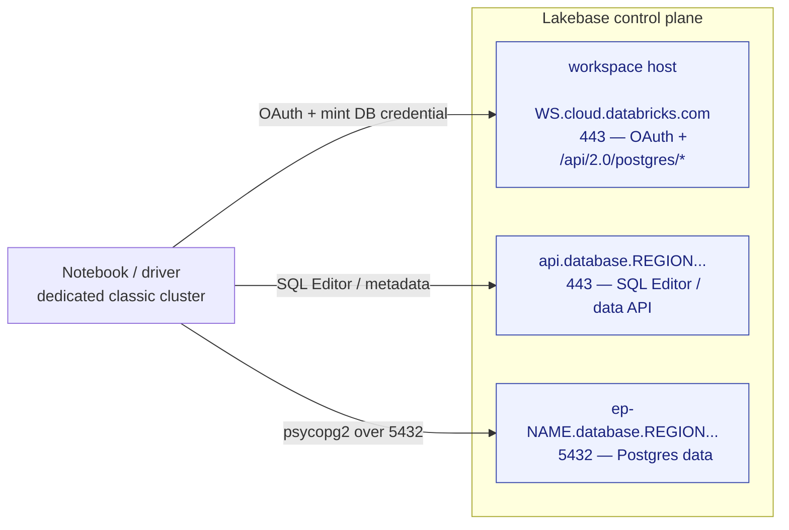
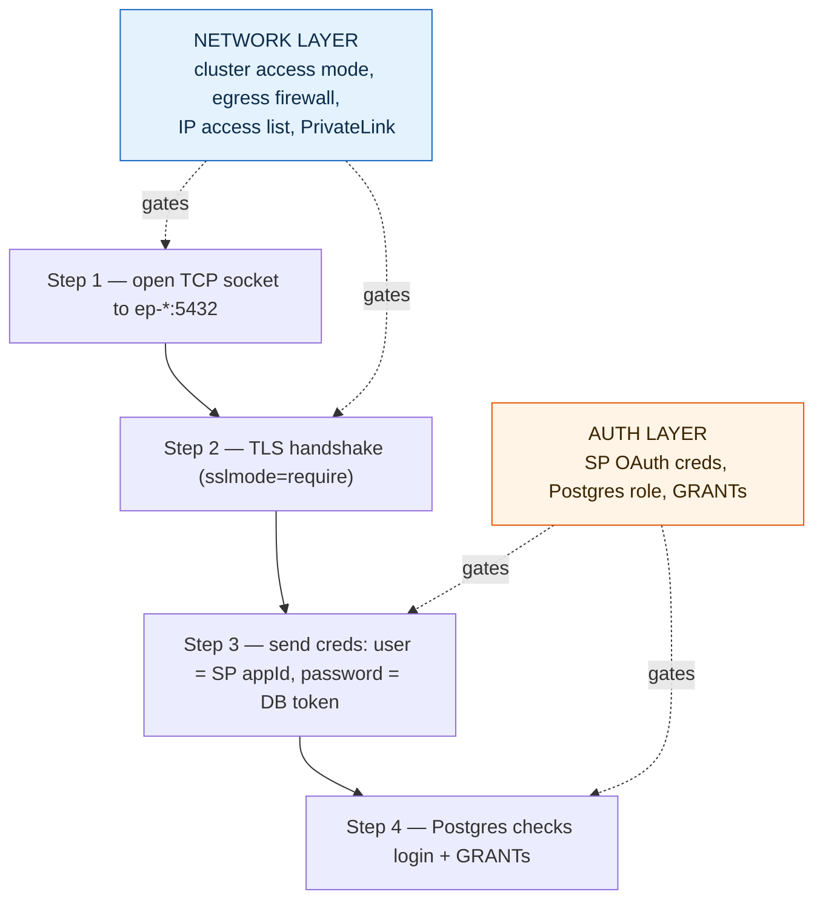
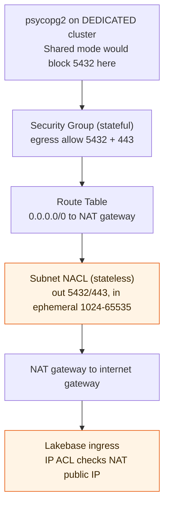
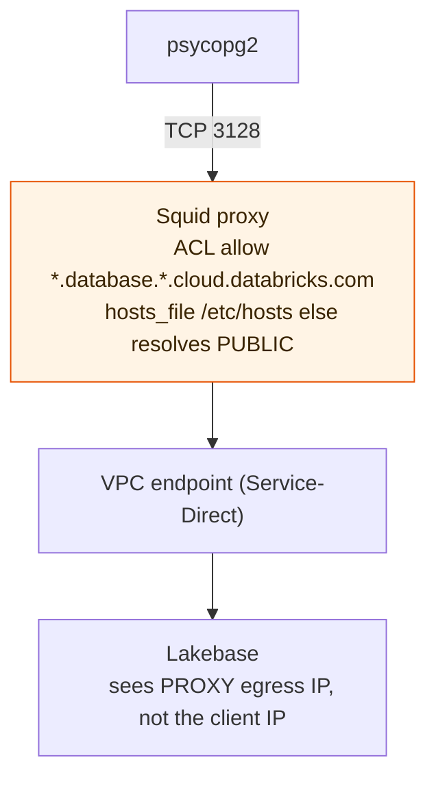
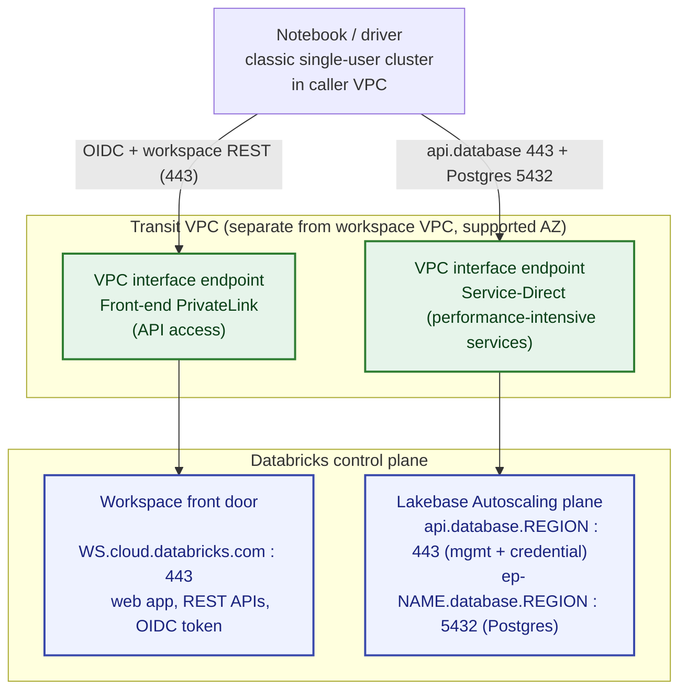
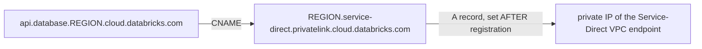
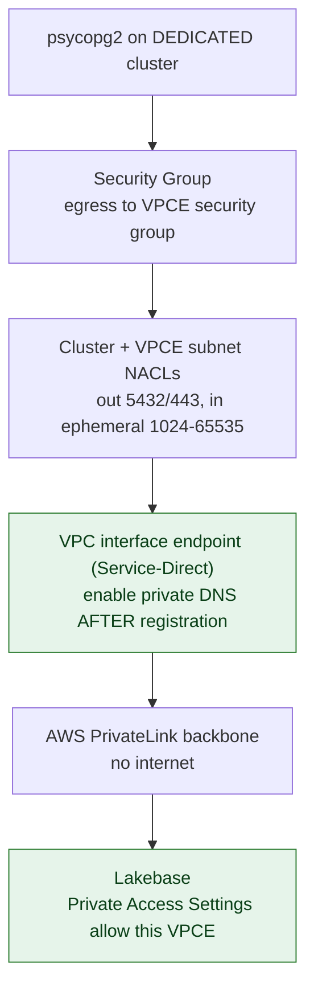
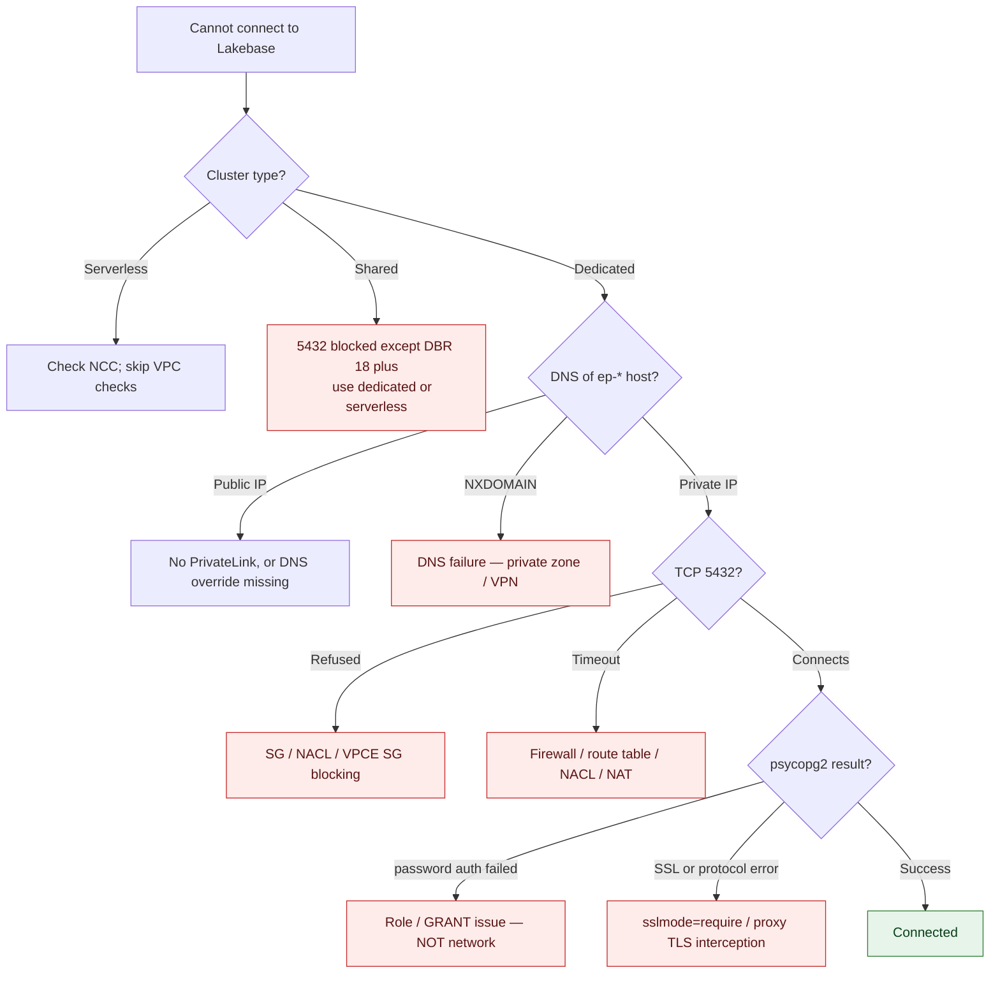
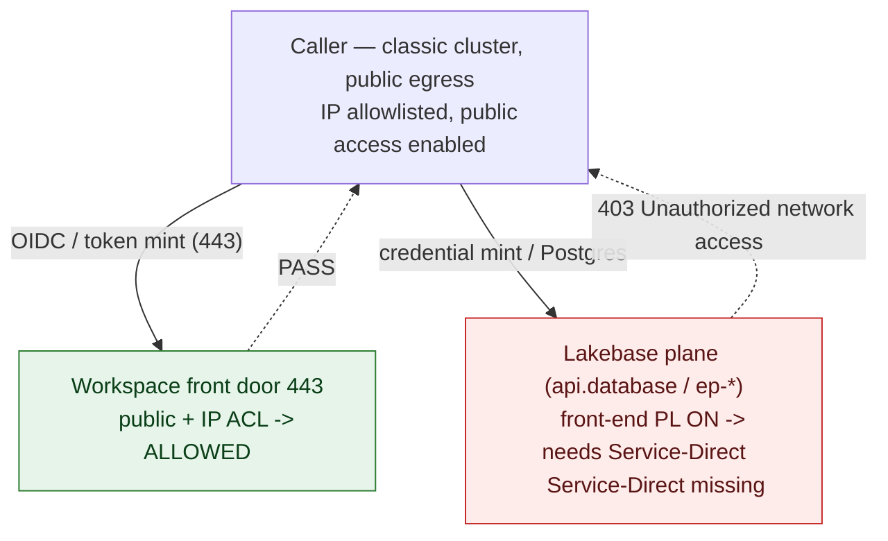

# Cross-Workspace Lakebase — Networking Guide

When the basic read works on an open workspace pair but **fails or hangs in a
locked-down environment** (IP access lists, PrivateLink, egress firewalls), use
this guide. It walks the restrictions from **simplest to hardest** — for each
one, *which* network hop it breaks and exactly what to configure.

Pair it with [`notebooks/cross_ws_lakebase_netdiag.py`](notebooks/cross_ws_lakebase_netdiag.py) —
run that in your compute workspace and it tells you which leg is failing and why.
Each restriction below maps to an `error_class` the notebook emits.

> **Cloud scope:** Lakebase is GA on **AWS** and **Azure** only. It is **not
> available on GCP** today — none of this applies there. AWS examples are
> primary; Azure differences are called out inline.

---

## 1. The network model (read this first)

The flow looks like one operation but is really **traffic to three control-plane
surfaces over two ports**, each with different governing controls. Almost every
config decision in this guide falls out of keeping them separate.

| Surface | Purpose | Destination | Port |
|---------|---------|-------------|------|
| **Workspace host** | mint the OAuth token, mint the DB credential, resolve the endpoint host (the SP / CLI / this notebook path) | the **workspace** URL (`<name>.cloud.databricks.com` / `adb-*.azuredatabricks.net`) | 443 |
| **Leg A — data API** | SQL Editor UI, table/branch metadata | `api.database.<region>.cloud.databricks.com` | 443 |
| **Leg B — data path** | the actual Postgres connection + `SELECT` | `ep-*.database.<region>.cloud.databricks.com` | **5432** |

Key facts that drive everything below:

- **`api.database.*` and `ep-*.database.*` share one regional ingress**,
  `*.database.<region>.cloud.databricks.com` — distinct from the workspace URL.
  Allowlisting the workspace URL alone is **not** enough.
- The **SP / CLI / this demo** mint tokens and resolve the host against the
  **workspace host**; the **SQL Editor UI** uses `api.database.*`. They can fail
  independently (see [the 4 scenarios](#which-surface-is-blocked-the-4-scenarios)).
- **Leg B is TCP 5432**, not 443. Firewalls that allow only 443 silently kill it.
- **Provisioned vs Autoscaling differ.** Autoscaling endpoints look like
  `ep-*.database.<region>.cloud.databricks.com` and use the *Service-Direct*
  private path (below). Provisioned instances look like
  `instance-<uuid>.database.cloud.databricks.com` and ride standard front-end
  PrivateLink. Confirm which tier you're on.

### Authentication and network reachability are different layers

A frequent point of confusion: *"I'm authenticating with a service principal
client_id/secret — why does the cluster's access mode matter?"*

Because they govern different things. Credentials decide **who you are**; the
network path decides **whether your packets can even get to the database**. Auth
can't help if the connection never leaves the cluster.

- **Steps 1–2 are the network layer** — governed by cluster access mode, egress
  firewall, IP access lists, and PrivateLink. If this fails you get a **TCP
  timeout/refused** and your credentials are never even presented.
- **Steps 3–4 are the auth layer** — governed by your SP OAuth credentials and
  the Postgres role/GRANTs. If this fails you get **`password authentication
  failed`** or **`permission denied`**.

You need **both**: an open road (steps 1–2) *and* the right key (steps 3–4).
Valid credentials over a blocked network look exactly like a firewall problem;
a perfect network with a missing GRANT looks exactly like an auth problem. The
diagnostic notebook tests them as separate probes for exactly this reason —
`TCP_TIMEOUT` on Leg B is a network finding, `PG_AUTH_FAILED` is not.

**Analogy:** the client_id/secret is the key to the building. A Standard/Shared
cluster (below) is the road to the building being closed — the key is irrelevant
if you can't drive there.

### Prerequisite that masquerades as a network bug

**Standard / Shared (`USER_ISOLATION`) classic clusters block arbitrary outbound
TCP — including 5432** — no matter how the network is configured or how valid
your credentials are. This is a multi-tenancy isolation feature: user code on a
shared cluster isn't allowed to open arbitrary network sockets. It is **not**
Lakebase-specific. Leg B only works from:

- a **Dedicated / single-user** classic cluster, or
- **serverless** compute.

Caveats: the block does **not** apply on **DBR 18+** shared clusters, and an
unsupported init-script workaround exists for older runtimes — but the supported
answer is to use a dedicated/single-user cluster or serverless. If `psycopg2`
can't reach 5432 but the rest of your network looks fine, check the cluster's
access mode **first**. The diagnostic notebook flags this in Probe 0 (it reads
the mode from the Clusters API).

---

## 2. The diagnostic (run this before you configure anything)

[`notebooks/cross_ws_lakebase_netdiag.py`](notebooks/cross_ws_lakebase_netdiag.py)
probes each leg **independently** and emits a per-leg verdict plus an
`error_class` you can match to the [signature table](#4-signature--diagnosis--fix)
and the recipes below. What it checks:

- **Probe 0 — cluster access mode** (reads the Clusters API): flags
  Shared/`USER_ISOLATION` before anything else, since that blocks 5432 regardless
  of network config.
- **Probe 1 — workspace host (443):** OAuth `/oidc/v1/token` + the
  `/api/2.0/postgres/*` REST calls; also prints the **egress IP** you'd allowlist.
- **Leg A — `api.database.<region>` (443):** the data/management API (SQL Editor).
- **Leg B — `ep-*.database.<region>` (5432):** DNS resolution, TCP connect, TLS,
  then the Postgres login — reported as separate sub-results so a network failure
  is never confused with an auth failure.

**How to run it:** import it into your **compute** workspace, attach it to a
**dedicated / single-user** classic cluster (not Shared), run it, and read the
per-leg verdict + the `DIAGNOSIS` block. It is read-only and safe to run anywhere.

---

## 3. Restrictions, simplest → hardest

The restrictions below are ordered by increasing network complexity. Each
section names the leg it breaks, the recipe to fix it, and the relevant diagram.

### 3a. IP access list on the Lakebase workspace (public path)

The simplest restriction. The cluster reaches Lakebase over the **public path**
(NAT gateway → internet), so its public egress IP must be allowlisted on the
**destination** (Lakebase) workspace.

1. Run the diagnostic — Probe 1 prints the egress IP (your NAT gateway EIP under
   SCC/back-end PL).
2. Add that IP (or your NAT EIP CIDR) to the Lakebase workspace's IP access list.
3. IP ACLs are a property of the *destination* (Lakebase) workspace — the caller
   can't opt out; the Lakebase admin must add your IP.

> **IP ACLs only apply to public-internet (public-IP) traffic.** Traffic that
> arrives over PrivateLink presents a private IP and is **not** subject to the
> IP access list. This is why "move to PrivateLink" and "allowlist my NAT IP"
> are two different, mutually-exclusive fixes for the same 403.

The diagnostic emits `HTTP_403_IP_ACL` (block string: `Source IP ... is blocked
by Databricks IP ACL`).

Docs: [IP access lists (AWS)](https://docs.databricks.com/aws/en/security/network/front-end/ip-access-list).

### 3b. Egress firewall / proxy + NACLs (compute workspace)

The next layer of restriction lives on **your** side: the compute workspace's
egress firewall, forward proxy, and subnet NACLs. The usual omission is **5432**.

Allow these from the compute workspace's egress (firewall / proxy):

| Destination | Port | For |
|---|---|---|
| your **workspace URL** (`<name>.cloud.databricks.com` / `adb-*.azuredatabricks.net`) | 443 | OAuth token mint + `/api/2.0/postgres/*` |
| `*.database.<region>.cloud.databricks.com` | 443 | Leg A (data API, SQL Editor) |
| `*.database.<region>.cloud.databricks.com` | **5432** | Leg B (Postgres) |
| (Azure also) `*.database.<region>.azuredatabricks.net` | 443 + 5432 | both legs on Azure |

**Ports reference:** `443` (HTTPS/REST/WSS), **`5432`** (Postgres wire),
`1024-65535` (ephemeral return traffic — **inbound** on stateless NACLs), `3128`
(Squid proxy), `6666` (SCC relay).

**AWS NACL reality (stateless):** unlike Security Groups, NACLs are stateless and
per-subnet. Custom NACLs (common in hardened accounts) must allow **outbound
5432/443 AND inbound ephemeral 1024-65535** for return traffic — on the cluster
subnet, the NAT subnet, and the VPCE subnet. The default NACL allows everything,
so this only bites with custom NACLs. (Azure NSGs are stateful at both NIC and
subnet level, so there's no equivalent inbound-ephemeral rule to add.)

**Proxy + PrivateLink (the boss level):**

- `sslmode=require` is mandatory.
- **Squid gotcha:** Squid ignores `/etc/hosts` for HTTPS `CONNECT` tunnels — add
  `hosts_file /etc/hosts` to `squid.conf`, and include
  `*.database.*.cloud.databricks.com` in the domain ACL, or PrivateLink DNS is
  bypassed and Squid resolves to a public IP.
- **SSL inspection** breaks the Postgres TLS handshake — Postgres TLS can't be
  MITM'd like HTTPS. Exempt the DB endpoint from interception.
- The Lakebase IP ACL sees the **proxy's** egress IP, not the original client.

The diagnostic emits `DATA_API_BLOCKED` (Leg A on 443),
`TCP_TIMEOUT`/`TCP_REFUSED`/`TCP_OSERROR` (Leg B 5432 blocked), or `PG_SSL_ERROR`
(TLS interception) depending on which hop the firewall/proxy breaks.

### 3c. Front-end PrivateLink + public access (the key nuance)

When the Lakebase workspace has **front-end PrivateLink** configured, the most
important thing to understand is what `public access enabled` actually covers:

> **`public access enabled` covers ONLY the front-end connection — the web app
> and REST/OIDC — NOT the Lakebase plane.** OIDC and `/api/2.0/postgres/*` ride
> the workspace front door; `api.database.*` and `ep-*` ride a *separate* plane
> (Service-Direct, §3d). You can have a perfectly working token mint over the
> public front door while the Lakebase plane is refused.

Cross-workspace access is also **not automatic** just because both workspaces are
in the same Databricks account. Two independent requirements:

- **Authorization** — the OAuth token grants identity; it works cross-workspace.
- **Reachability** — with public access disabled, the caller's traffic must
  arrive over a **private route**. The compute VPC needs its own interface
  endpoint (or a peered/private route) to the Lakebase workspace's front-end
  PrivateLink service, and that endpoint must be permitted in the Lakebase
  workspace's Private Access Settings.

If control-plane calls hang or reset, the diagnostic emits
`HTTP_TIMEOUT`/`HTTP_CONN_ERROR` — front-end PL with public access disabled and
no private route from this VPC, or an egress firewall blocking 443.

Docs: [Configure front-end PrivateLink (AWS)](https://docs.databricks.com/aws/en/security/network/front-end/front-end-private-connect).

### 3d. Service-Direct (performance-intensive) PrivateLink — the crux

To carry the **5432 data path** privately (no internet), Lakebase Autoscaling
uses **Service-Direct PrivateLink** ("inbound Private Link for performance-
intensive services") — a **separate** inbound endpoint from classic front-end
PrivateLink, and **not** an NCC rule. This is the most involved restriction, and
the one behind the case study in §5.

**The two-endpoint model.** A PrivateLink workspace needs **both** inbound
endpoints, and they carry different traffic. The front-end PL endpoint carries
the workspace front door (web/REST/OIDC); the **Service-Direct** endpoint carries
the entire Lakebase plane — **both `api.database.<region>` (443) and
`ep-*.database.<region>` (5432)**. Miss the Service-Direct endpoint and the
Lakebase plane is unreachable even though OIDC over the front door still works.

**DNS chain** — `api.database.<region>` resolves *through* the Service-Direct
endpoint (this is why that endpoint carries the management/credential calls too):

**Per-subnet/SG hop view** (what each network layer must allow):

**Setup:**

- **AWS:** create a **VPC interface endpoint** to the region's Service-Direct
  service, attach it via Private Access Settings, and configure DNS so
  `<region>.service-direct.privatelink.cloud.databricks.com` resolves to the
  endpoint.
  - **Register first, then enable private DNS.** Don't enable Private DNS before
    registering the endpoint in the account console — enabling it early routes
    traffic over PrivateLink but requests are rejected until registration
    completes.
  - **Same-VPC limitation:** if the endpoint is in the *same VPC* as the
    workspace, only 80/443/53 are allowed — you need a **separate VPC** to carry
    5432.
  - **AZ restriction:** not all availability zones are supported; place the
    endpoint in a supported AZ.
- **Azure:** create a **Private Endpoint** to the Service-Direct resource
  (sub-resource `service_direct`), register it (must reach APPROVED), and add
  the A record in the `privatelink.azuredatabricks.net` private DNS zone.
- Requires Enterprise (AWS) / Premium (Azure) tier and the feature enabled at
  the account level. **Currently Public Preview.**
- **Provisioned** instances don't need this — they ride standard front-end PL.

The diagnostic emits `TCP_TIMEOUT`/`TCP_REFUSED` (Leg B with no private path) or
`DNS_NXDOMAIN` (private DNS not configured) when Service-Direct is required but
missing.

Docs: [Service-Direct PrivateLink (AWS)](https://docs.databricks.com/aws/en/security/network/front-end/service-direct-privatelink) ·
[Service-Direct (Azure)](https://learn.microsoft.com/en-us/azure/databricks/security/network/front-end/service-direct-privatelink) ·
[Private Link for Lakebase (Azure)](https://learn.microsoft.com/en-us/azure/databricks/oltp/projects/private-link).

### 3e. Context-based ingress (CBIC)

Context-based ingress is a separate enforcement layer from IP access lists. It
treats **"Lakebase Compute"** as a distinct access type, separate from Workspace
UI/APIs, so you can allow or deny the Lakebase plane independently.

- Requires **Enterprise tier** and **public access enabled**. If public access is
  **disabled**, CBIC is **not evaluated** (the traffic arrives privately and CBIC
  doesn't apply).
- If Leg A/B is reachable at the network layer but still rejected, check CBIC in
  addition to the IP ACL — a narrower context rule can independently block
  traffic the IP ACL would otherwise allow.

Docs: [Context-based ingress](https://docs.databricks.com/aws/en/security/network/front-end/context-based-ingress).

### 3f. Back-end PrivateLink / SCC on the compute workspace (irrelevant to inbound)

Back-end PrivateLink / SCC governs the **compute cluster ↔ its own control plane**
relationship — it is **irrelevant to inbound cross-workspace Lakebase access**.
SCC removes the cluster's public **inbound** IP and routes cluster↔control-plane
traffic privately, but it does **not** by itself give you a path to Lakebase.
Egress to Lakebase is governed by your **customer-managed VPC**:

- **Public path:** security groups + route tables + **NAT gateway** → reaches
  443 and 5432 on `*.database.<region>.*`; the Lakebase IP ACL then sees the NAT
  EIP and must allow it (§3a).
- **Private path:** the **Service-Direct VPC endpoint** (§3d).
- **NCC** governs *serverless* egress, not classic compute — don't reach for NCC
  to fix a classic-cluster Lakebase path.

---

## 4. Signature → diagnosis → fix

These map 1:1 to the `error_class` values the diagnostic notebook emits.

| Notebook signature | What it means | Fix |
|---|---|---|
| `DNS_NXDOMAIN` | a hostname won't resolve | Under PrivateLink you need **private DNS** for `*.database.<region>.cloud.databricks.com` (Route 53 private hosted zone / Azure private DNS zone). On the public path, check your resolver isn't filtering. |
| `HTTP_403_IP_ACL` | `Source IP ... is blocked by Databricks IP ACL` (on OIDC/well-known) | Add the cluster's **egress IP** (printed by Probe 1) to the Lakebase workspace IP access list (§3a). |
| `HTTP_TIMEOUT` / `HTTP_CONN_ERROR` | control-plane calls hang or reset | Front-end PrivateLink with public access disabled and **no private route from this VPC**, or an egress firewall blocking 443. Provision a private route (front-end PL endpoint) or open 443 egress (§3c). |
| `DATA_API_BLOCKED` (`api.database.*`) | the data API is unreachable while the workspace host / 5432 may be fine | `api.database.<region>` blocked by proxy / PL / firewall on 443. Symptom: "SQL Editor broken but notebook queries work" (or vice-versa). Allowlist `api.database.<region>` on 443. See [the 4 scenarios](#which-surface-is-blocked-the-4-scenarios). |
| `OAUTH_BAD_CREDS` | reachable, creds rejected (401/400) | **Not a network problem.** Check `client_id`/`client_secret` and that the SP exists in the Lakebase workspace. |
| `TCP_TIMEOUT` / `TCP_REFUSED` / `TCP_OSERROR` (Leg B) | can't reach 5432 | (1) Shared cluster? switch to dedicated/serverless. (2) Egress firewall blocking 5432 → open it to `ep-*.database.<region>.cloud.databricks.com` (§3b). (3) Need a private path → Service-Direct PrivateLink (§3d). |
| `PG_SSL_ERROR` | TLS negotiation broke on 5432 | A TLS-intercepting forward proxy is breaking Postgres SSL (it can't be MITM'd like HTTPS). Bypass the proxy for the DB endpoint. (Squid: add `hosts_file /etc/hosts` and allow `*.database.*.cloud.databricks.com`.) |
| `PG_SSL_DISABLED` (`Invalid protocol version: 196608`) | connected, but SSL wasn't negotiated | Set `sslmode=require` on the connection. |
| `PG_TOKEN_OR_IDENTITY` (`Invalid authorization for databricks identity login`) | OAuth token expired (~1h) or a group identity is being used on a dedicated cluster | Re-mint the token; ensure the dedicated cluster's single-user identity matches the SP/user that owns the Postgres role. |
| `LAKEBASE_CRED_403` | `Unauthorized network access to workspace <id>` — **403 on `/api/2.0/postgres/credentials` while OAuth from the same IP succeeded** | The credential-mint endpoint enforces a **network policy separate from the workspace IP ACL** (necessary but not sufficient). The target likely has **front-end PL enabled** so the Lakebase plane needs the **Service-Direct** endpoint (§3d) — `public access enabled` only covers the front door. See the [case study](#5-case-study--the-solved-403). |
| `PG_AUTH_FAILED` | TCP 5432 connected, Postgres rejected the login | **Network is fine.** SP Postgres role / GRANT step — see the main [README](README.md) gotchas #4, #5. |

Two more that aren't network failures but bite people:

- **`Connection closed unexpectedly`** → enable the **"Postgres Native Role
  Login"** toggle on the Lakebase project.
- **SQL Editor works but the notebook hangs** → psycopg2 `autocommit=False`;
  set `conn.autocommit = True` (this demo's notebooks already do).

### Which surface is blocked? (the 4 scenarios)

Because `api.database.*` (SQL Editor / data API) and `ep-*.database.*` (raw
5432) can be blocked **independently**, the symptom tells you which surface to
fix:

| # | `api.database.*` (SQL Editor) | `ep-*` queries (5432) | Customer says | Likely cause |
|---|---|---|---|---|
| 1 | ✅ | ✅ | "Everything works" | — |
| 2 | ❌ | ❌ | "Nothing works" | both surfaces blocked (DNS, IP ACL, or no route at all) |
| 3 | ❌ | ✅ | "Queries work in the notebook but SQL Editor is broken" | `api.database.*` (443) blocked |
| 4 | ✅ | ❌ | "I can see tables but can't run queries" | `ep-*` (5432) blocked — proxy allowlist / firewall / PL |

> "Failed to fetch" / "Unknown error" in SQL Editor **with PrivateLink** usually
> means only front-end PL is set up and the **Service-Direct** (perf-intensive)
> endpoint is missing.

### Decision tree

---

## 5. Case study — the solved 403

This is the payoff: a real restricted environment where every obvious control
was satisfied and the connection *still* failed — until the two-endpoint model
(§3d) explained it.

**The setup.** A caller on the **public path** with everything that "should" work:

- the cluster's egress IP was **allowlisted** in the Lakebase workspace IP ACL,
- **public access was enabled** on the target workspace,
- **context-based ingress was disabled**,
- and `/oidc/v1/token` **succeeded** from that IP.

**The failure.** Despite all of the above, `POST /api/2.0/postgres/credentials`
returned **403 "Unauthorized network access to workspace `<id>`"**. OAuth worked;
the credential mint did not.

**The cause.** The target had **front-end PrivateLink enabled**. As §3c explains,
`public access enabled` covers only the **front-end connection (web/REST/OIDC)** —
which is why the token mint worked. The **Lakebase plane** (`api.database.*` /
`ep-*`) rides the **Service-Direct (performance-intensive services)** endpoint,
which a PrivateLink workspace *also* requires — and it was **missing**. So the
front door was open while the Lakebase plane was refused. A no-PL workspace (like
the simple-case control) serves the Lakebase plane publicly, which is exactly why
the simple case works and this one didn't.

**The fix (confirmed).** Provision the **Service-Direct inbound endpoint** and
route the caller through it (§3d) — *not* an additional IP allowlist entry. With
Service-Direct in place, both `api.database.*` (443) and `ep-*` (5432) reach the
Lakebase plane privately and the credential mint succeeds. The diagnostic flags
this exact case as `LAKEBASE_CRED_403` (distinct from `HTTP_403_IP_ACL`, which
appears on OIDC). If a target already has Service-Direct registered and still
403s, all documented controls are satisfied — capture the `request_id` from the
response and escalate.

---

## 6. Three architecture paths (pick per environment)

| Path | How | Best when |
|------|-----|-----------|
| **1 — Public endpoint** (what the demo does) | NAT egress to the public Lakebase endpoint; allowlist the NAT IP on the workspace IP ACL | Egress is open or you can allowlist a stable NAT EIP |
| **2 — Private endpoint** | Service-Direct PrivateLink (AWS/Azure) so Leg B never touches the internet | Public access disabled, strict-egress, regulated workloads |
| **3 — Unity Catalog instead of a raw socket** | Register the Lakebase database in UC (read-only catalog) and query via a SQL warehouse, or use Lakehouse Federation | You'd rather not open 5432 from the caller at all; you want UC governance |

Path 3 moves the network path onto the UC connection's compute (often serverless,
NCC-governed) rather than your classic cluster:
[Register a Lakebase database in UC](https://docs.databricks.com/aws/en/oltp/projects/register-uc) ·
[Lakehouse Federation for PostgreSQL](https://docs.databricks.com/aws/en/query-federation/postgresql) ·
[Synced tables (reverse-ETL, for context)](https://docs.databricks.com/aws/en/oltp/projects/sync-tables).

### Operational notes

- **Token lifetimes:** the workspace OAuth token and the Lakebase DB credential
  are each ~1 hour. Re-mint inside long jobs.
- **Token-mint rate limit:** per-connection credential mints hit a SCIM
  (~1k/workspace) limit. For anything beyond a demo, **cache the OAuth token and
  pool connections** (e.g. PgBouncer) rather than minting per query.
- **Azure OAuth caveat:** OAuth requires **per-workspace URLs**. If the
  subscription is on the per-workspace-URL opt-out list (canonical name
  `<region>.azuredatabricks.net` instead of `adb-<id>.<n>.azuredatabricks.net`),
  OAuth breaks — remove it from the opt-out list.
- **Auth flow parity:** the SP m2m flow (`client_id`/`client_secret` →
  `/oidc/v1/token` → DB credential) is identical on AWS and Azure; only the
  workspace host differs. See [Lakebase authentication](https://docs.databricks.com/aws/en/oltp/projects/authentication).
- **GCP:** out of scope — Lakebase is not available on GCP today.

---

## 7. How to test in your own environment

1. Set up the SP, secret scope, and Postgres role per the [README](README.md).
2. Import [`notebooks/cross_ws_lakebase_netdiag.py`](notebooks/cross_ws_lakebase_netdiag.py)
   into your **compute** workspace.
3. Attach it to a **dedicated / single-user** classic cluster (not Shared).
4. Run it. Read the per-leg verdict and the `DIAGNOSIS` block.
5. Match each `error_class` to the [signature table](#4-signature--diagnosis--fix)
   above and apply the corresponding recipe in §3; use [the 4 scenarios](#which-surface-is-blocked-the-4-scenarios)
   to tell which surface (`api.database.*` vs `ep-*`) is blocked.

The notebook is read-only and safe to run anywhere.

### Sources (public docs)

- [Connect to Lakebase](https://docs.databricks.com/aws/en/oltp/projects/connect)
- [Private Link for Lakebase Autoscaling](https://docs.databricks.com/aws/en/oltp/projects/private-link)
- [Service-Direct PrivateLink (AWS)](https://docs.databricks.com/aws/en/security/network/front-end/service-direct-privatelink)
- [Service-Direct PrivateLink (Azure)](https://learn.microsoft.com/en-us/azure/databricks/security/network/front-end/service-direct-privatelink)
- [Context-based ingress](https://docs.databricks.com/aws/en/security/network/front-end/context-based-ingress)
- [IP access lists](https://docs.databricks.com/aws/en/security/network/front-end/ip-access-list)
- [IP addresses & domains](https://docs.databricks.com/aws/en/resources/ip-domain-region)
- [Lakebase authentication](https://docs.databricks.com/aws/en/oltp/projects/authentication)
- [Register a Lakebase database in UC](https://docs.databricks.com/aws/en/oltp/projects/register-uc)
- [Lakehouse Federation (PostgreSQL)](https://docs.databricks.com/aws/en/query-federation/postgresql)
